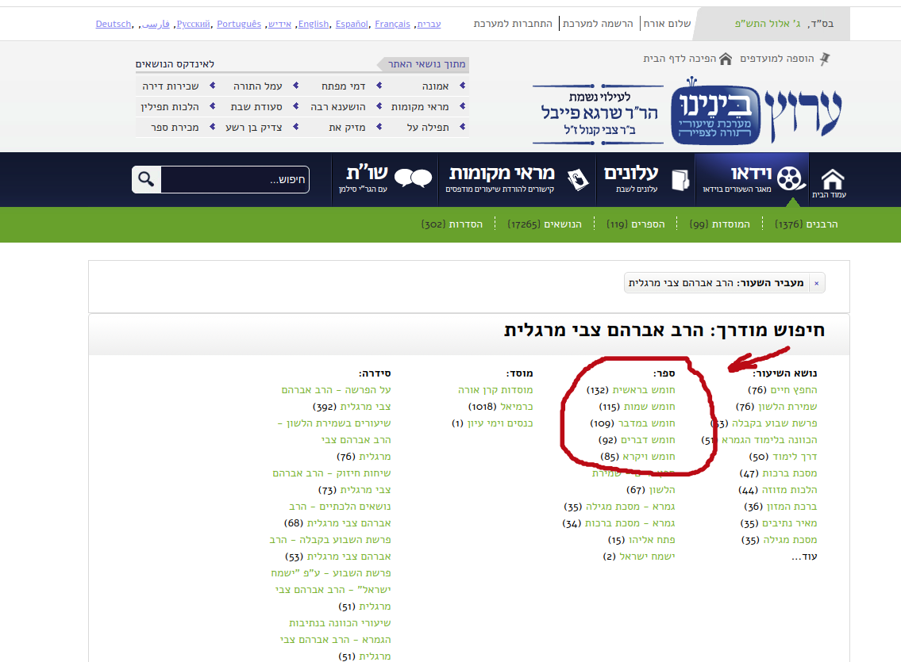

## 1. Objetivo:
- Colocar todos os shiurim do רב אברהם צבי מרגלית שליט"א no storage.

- No final das contas nas queremos rodar o seguinte comando para cada shiur:
curl -H "Referer: http://vod.wgnmedia.com/VOD/vod.php\?ID\=74645\&CS\=26" http://vod.wgnmedia.com/VOD/LIB.MP4/v74645.mp4 --output bereshit-5779.mp4

## 2. Comecamos por [aqui](http://beinenu.com/faceted_search/results/field_rabbi4lesson%3A43971). Esta e' a pagina com a lista completa dos shiurim do rabino.<br>

## 3. Em seguinda vamos escolher um dos cinco livros do Chumash. Por exemplo: [חומש בראשית](http://beinenu.com/faceted_search/results/taxonomy%3A47499%20field_rabbi4lesson%3A43971).
Obs.: Obviamente, temos que repetir todo o processo nos outros 4 livros (שמות, ויקרא...).
- Obs.: A lista foi divida em 7 paginas.

- Antes de entrar no primeiro shiur deve-se guardar na memoria o nome da parasha e o ano antes de acessar o [video](http://beinenu.com/lessons/%D7%A4%D7%A8%D7%A9%D7%AA-%D7%91%D7%A8%D7%90%D7%A9%D7%99%D7%AA-17). O nome consta na tbm na pag. do video.
- o nome devera' ser guardado de forma que o arquivo receba o nome com a parasha e o ano, assim: bereshit-5779.mp4

- F12 > Network > clicar play no video > localizar o arquivo mp4 e copiar o curl >
    ```
    curl 'http://vod.wgnmedia.com/VOD/LIB.MP4/v74645.mp4' \
      -H 'Referer: http://vod.wgnmedia.com/VOD/vod.php?ID=74645&CS=26' \
      -H 'User-Agent: Mozilla/5.0 (X11; Linux x86_64) AppleWebKit/537.36 (KHTML, like Gecko) Chrome/84.0.4147.125 Safari/537.36' \
      -H 'Range: bytes=1966080-' \
      --compressed \
      --insecure
    ```

## 4. Sugestao:

- [Veja](https://stackoverflow.com/questions/36433755/ghematria-in-python-hebrew-letters-to-numbers-and-sum) StackOverflow para saber como tirar a Ghematria dos anos em hebraico com Python
- Talvez usar switch-case para converter o nome das parashiot:

בראשית
נח
לך לך
וירא
חיי שרה
תולדות
ויצא
וישלח
וישב
מקץ
ויגש
ויחי

שמות
וארא
בא
בשלח
יתרו
משפטים
תרומה
תצוה
כי תשא
ויקהל
פקודי
ויקהל-פקודי

ויקרא
צו
שמיני
תזריע
מצורע
אחרי מות
קדושים
אמור
בהר
בחוקותי
תזריע-מצורע
אחרי-קדושים
בהר-בחוקותי

במדבר
נשא
בהעלותך
שלח
קורח
חוקת
בלק
פינחס
מטות
מסעי
חוקת-בלק
מטות-מסעי

דברים
ואתחנן
עקב
ראה
שופטים
כי תצא
כי תבוא
ניצבים
ניצבים-וילך
וילך
האזינו
ברכה




